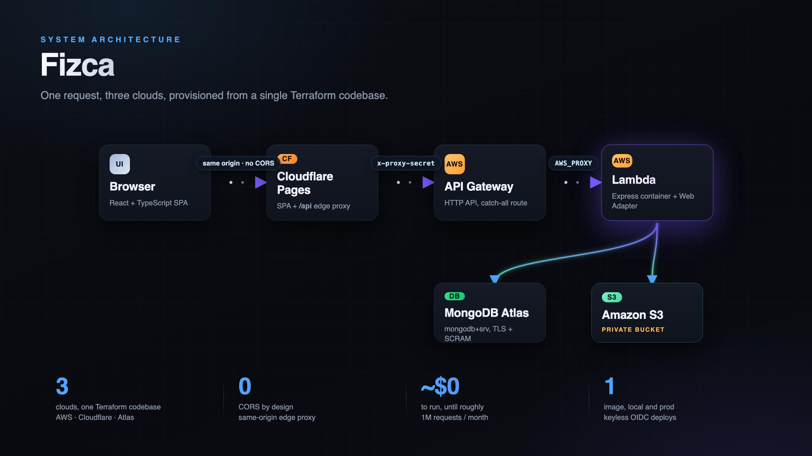
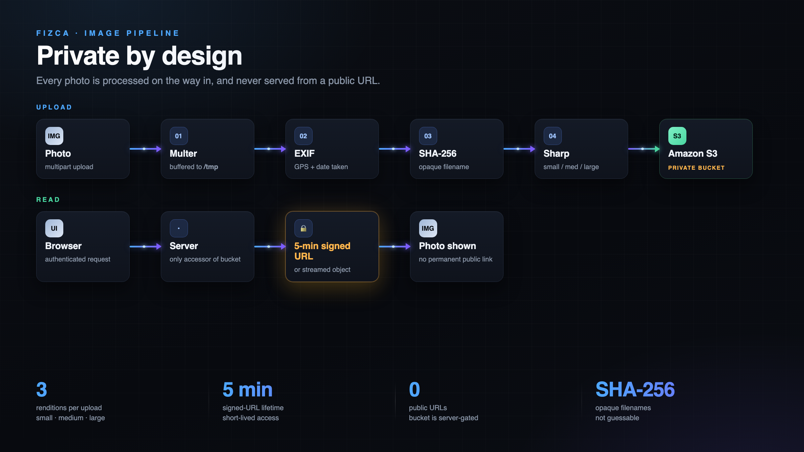
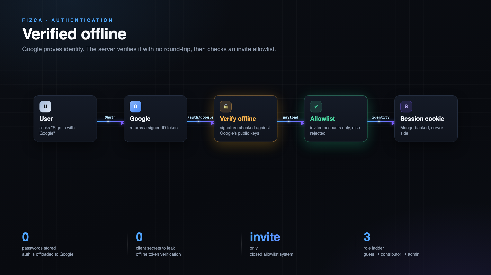
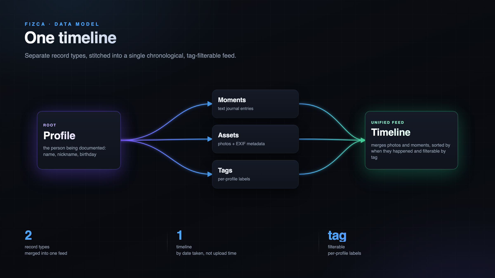

# Fizca

> Fizca means **soul** in quechua.

Fizca is a private, invite-only photo and memory journal. You create a profile for someone you care about, a kid or a pet, and fill it over time with photos and journal entries. It all lands on one timeline you can scroll and filter by tag.

I built every layer: the React frontend, the CSS, the REST API, the image pipeline, the data model, and the cloud infrastructure. Every technology choice was deliberate, and the diagrams below walk through the ones that matter most.

## Architecture

The whole backend is serverless and costs close to nothing until roughly a million requests a month. The browser only ever talks to one origin: a Cloudflare Pages function proxies every `/api` call to AWS, so there is no CORS to configure, there is simply no cross-origin request to begin with. Behind that proxy sit an HTTP API Gateway and a Lambda, with MongoDB Atlas and a private S3 bucket holding the data and the images. The entire stack, across AWS, Cloudflare, and MongoDB Atlas, is defined in one Terraform codebase and deployed with keyless GitHub Actions through OIDC, so there are no long-lived cloud keys sitting in CI.

## The image pipeline

Images are the core of the product, so they are also where most of the security decisions live. On upload, the server reads the photo's EXIF data for location and date, hashes the filename so it is opaque, and uses Sharp to produce three sizes before storing them in a private S3 bucket. Nothing in that bucket is public. When the app needs to show a photo, the server either streams it through an authenticated request or hands out a pre-signed URL that expires in five minutes. There is no permanent public link to anyone's photos.

## Authentication

Authentication is offloaded to Google, so there are no passwords to store. When a user signs in, the client sends a Google ID token and the server verifies it offline against Google's public keys, with no callback round-trip and no client secret to leak. Access is closed on top of that: only pre-invited accounts can log in, and a small role ladder, guest to contributor to admin, controls what each user can do. Identity lives in a server-side session, not a token in the browser.

## Data model

Photos and journal moments are stored as separate records, but they are stitched into a single timeline, sorted by when each thing actually happened rather than when it was uploaded. Tags are per-profile labels that make the whole feed filterable. That unified timeline is what ties the product together.

## The frontend

The frontend is React with strict TypeScript, built with Vite, with state managed by MobX. There is no component library: the design system is hand-coded with CSS custom properties and styled-components, and transitions use Framer Motion. The photo feed is an infinite scroll I wrote myself, an IntersectionObserver plus a small fetch hook, with no data-fetching library.

# Walkthrough

## Links

- Backend: https://github.com/Fizca/server
- Frontend: https://github.com/Fizca/client
- Walkthrough video: [Fizca Tech Walkthrough](https://youtu.be/24PsF98nUVE)
