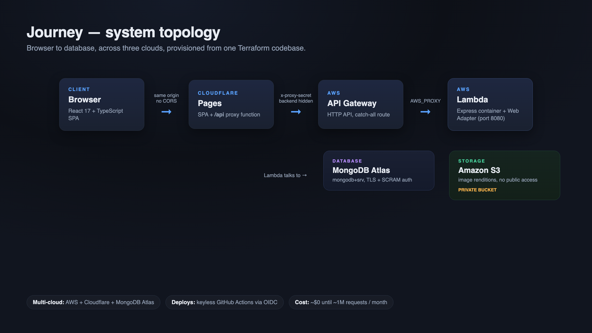

# Fizca

A home for the things I build on my own time. Everything here is designed, coded, and shipped by me, start to finish.

The current project is Journey.

## Journey

Journey is a private, invite-only photo and memory journal. You create a profile for someone you care about, a kid or a pet, and fill it over time with photos, journal entries, and growth stats. It all lands on one timeline you can scroll and filter by tag.

I built every layer: the React frontend, the CSS, the REST API, the image pipeline, the data model, and the cloud infrastructure. Every technology choice was deliberate.

### How it is built

**Frontend**
- React with strict TypeScript, built with Vite, state managed with MobX.
- A hand-coded design system: CSS custom properties for the tokens, styled-components for the pieces, Framer Motion for transitions.
- A hand-built infinite-scroll feed using an IntersectionObserver and a small fetch hook, no data-fetching library.

**Backend**
- A plain Express REST API on Node.
- Image pipeline: EXIF extraction, SHA-256 opaque filenames, and Sharp resizing into three renditions.
- Images live in a private S3 bucket and are never public. The server either streams them through an authenticated request or hands out a pre-signed URL that expires in five minutes.
- Auth is Google OAuth, verified offline against Google's public keys, with a closed invite allowlist and server-side sessions. No passwords stored.

**Infrastructure**
- Serverless and close to zero cost until roughly a million requests a month.
- The Express app ships as a container image on AWS Lambda via the Lambda Web Adapter, so the same image runs locally and in production.
- CORS is designed out: a Cloudflare Pages function proxies every request so the SPA and the API share one origin.
- One Terraform codebase across AWS, Cloudflare, and MongoDB Atlas. Deploys are keyless through GitHub Actions OIDC.

### Links

- Backend: https://github.com/Fizca/server
- Frontend: https://github.com/Fizca/client
- Walkthrough video: [coming soon](https://youtu.be/REPLACE_WITH_VIDEO_ID)
